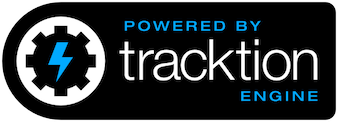

# tracktion_engine
##### Welcome to the Tracktion Engine repository!
The aim of Tracktion Engine is to provide a high level data model and set of classes for building sequence based audio applications. You can build anything from a simple file-player or sequencer to a full blown DAW.

##### Supported Platforms
- macOS
- Windows
- Linux
- Raspberry PI
- iOS
- Android

## Getting Started
Tracktion Engine is supplied as a `JUCE module` so it can easily fit in to an existing JUCE application. You'll find the module code under `modules/tracktion_engine`. Additionally, JUCE is added as a Git Submodule here in order to build the examples.

To start with, clone the repo and recurse the submodules:
```
$ git clone --recurse-submodules https://github.com/Tracktion/tracktion_engine.git
```

## Examples
Example projects are located in `/examples`. Because these are provided as JUCE PIPs, the `Projucer` needs to be built to generate the projects. This can be easily done with the scripts contained in `/tests`.
```
$ cd tests/mac
$ ./generate_examples
```
`generate_examples` will build the Projucer and generate the project files for you. Alternatively you can run the `build_examples` script to build the examples as well, ready to run.

Once the example projects have been generated or built you can find them in `examples/projects`.
Start with the `PitchAndTimeDemo` or `StepSequencerDemo` to see some basic apps in action.

## Tutorials
Once you're ready to dive in to the code, open the IDE files and have a read through the tutorials in `/tutorials`. You can view these on GitHub [here](/tutorials) to see the rendered Markdown.

## License
Tracktion Engine is covered by a [GPL/Commercial license](https://www.gnu.org/licenses/gpl-3.0.en.html).

There are multiple commercial licensing tiers for Tracktion Engine, with different terms for each.
For prices, see the [Tracktion Developers Page](https://www.tracktion.com/develop/tracktion-engine).
